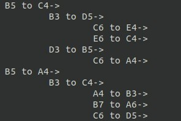

# 8X8 Checkers

Checkers (also known as Draughts) is a popular group of board games. The most commonly played one is an 8x8 version of American Checkers (also known as English Draughts).

We have developed a terminal version of this game.


# How to run the game?

```bash
$ git clone "https://github.com/esh04/Checkers.git"
$ cd Checkers
$ gcc main.c checkers.c
$ ./a.out
```

# How to play the game?

These are the following rules for the game that one must follow:

- The game begin's with O's move
- Normal Pieces can only move one diagonal space forward
- To capture an opposing piece,"jump" over it by moving two diagonal spaces in the direction of
the the opposing piece
- A piece may jump forward over an opponent's pieces in multiple parts of the board to capture
them
- Keep in mind, the space on the other side of your opponent’s piece must be empty for you to capture it
- If your piece reaches the last row on your opponent's side
- King pieces has the same rules as a normal piece except that it can move forward and backwards both
- There is no limit to how many king pieces a player may have
- A player wins by capturing all of the opponent's pieces or by leaving the opponent with no legal move. The game is a draw if neither side can force a win, or by agreement (one side offering a draw, the other accepting)
- If capture of a piece is possible, only that move must be played

# Features of the game

- A fully functional 8x8 American Checkers game
- A feature to UNDO as many moves as asked by the players (provided both players agree)
- A feature to REVIEW the game from the start, so the players can see what led to the current game state if they wish to
- A feature to SHOW ALL POSSIBLE MOVES for the next k turns (if both players make a move each, that is counted as two turns), where k is a number that the player gives, in our program k must be ≤ 3 but it can easily be increased in constants.h if one wishes to; the output format for this function is the first column represents the possible moves in the k=1 turn, second column in k=2 and so on, represented like a tree structure, with the parent-> followed by its children i.e. the moves succeeding that move, an example of this is showed below


# Enjoy the game!!